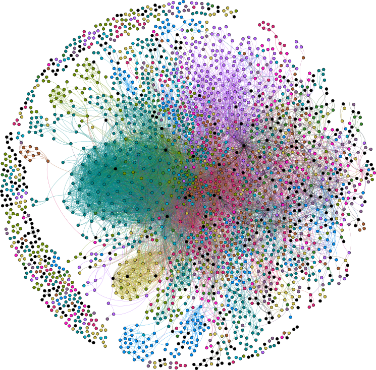

The Girke lab investigates fundamental questions at the interface of genome
biology and chemical genomics. Central questions include: Which features of
genomes, proteomes, and metabolomes are functionally relevant and amenable to
perturbation by small molecules? Which properties of small molecules and their
targets determine compound–target interactions? And how can these insights be
translated into precise perturbation strategies for biological processes in
agriculture and human health?

To address these questions, the lab develops computational methods for the
analysis of large-scale omics and small-molecule bioactivity data. This
includes both discovery-driven research and the development of algorithms and
software for diverse Big Data technologies, including next-generation
sequencing, genome-wide profiling approaches, and chemical genomics. Reflecting
the multidisciplinary nature of this work, the group frequently collaborates
with experimental scientists on data-intensive projects addressing complex
biological problems. Another major focus is the development of integrated data
analysis infrastructure for the open-source software ecosystems R and
Bioconductor. The following sections provide brief summaries of selected
research projects.
