

## Current Members

::: {.member-grid}

::: {.member-card}
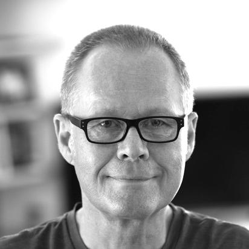{.member-photo alt="Portrait of Thomas Girke"}
**Thomas Girke**  
Principal Investigator
:::

::: {.member-card}
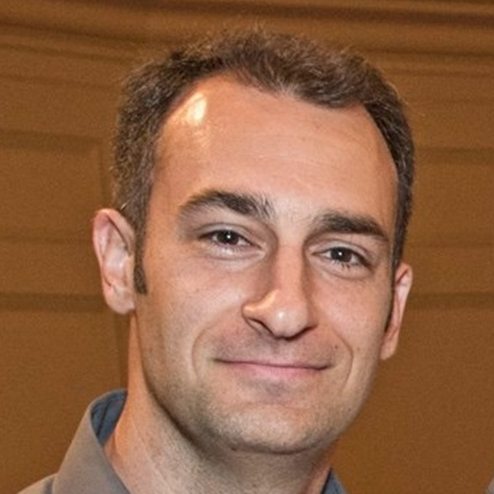{.member-photo alt="Portrait of Brendan Gongol"}
**Brendan Gongol**  
Postdoctoral Scholar
:::

::: {.member-card}
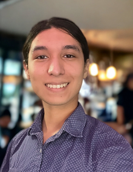{.member-photo alt="Portrait of Desmond Cairo"}
**Desmond Cairo**  
Graduate Student, GGB
:::

::: {.member-card}
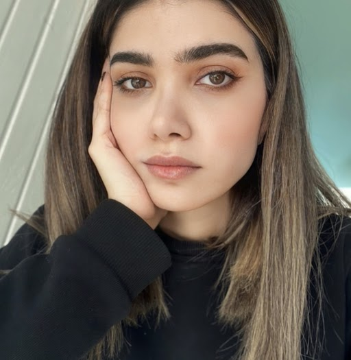{.member-photo alt="Portrait of Tandis Salem"}
**Tandis Salem**  
Graduate Student, GGB
:::

::: {.member-card}
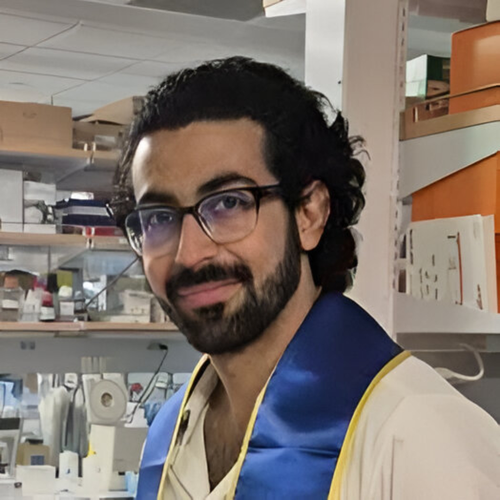{.member-photo alt="Portrait of Mohammad Afsharinia"}
**Mohammad Afsharinia**  
Graduate Student, GGB
:::

::: {.member-card}
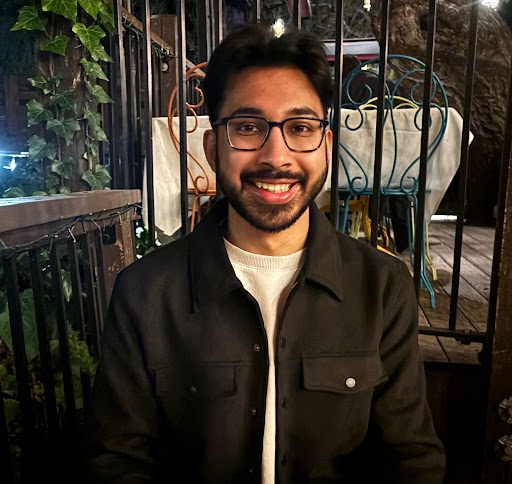{.member-photo alt="Portrait of Bigy Ambat"}
**Bigy Ambat**  
Graduate Student, GGB
:::

::: {.member-card}
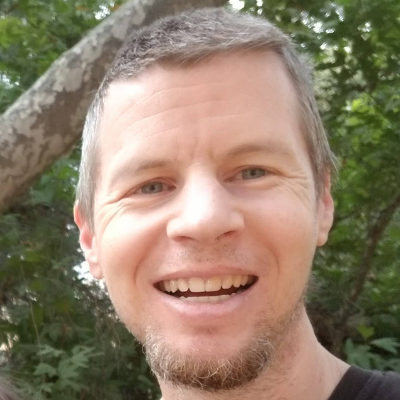{.member-photo alt="Portrait of Kevin Horan"}
**Kevin Horan**  
Postdoctoral Scholar
:::

::: {.member-card}
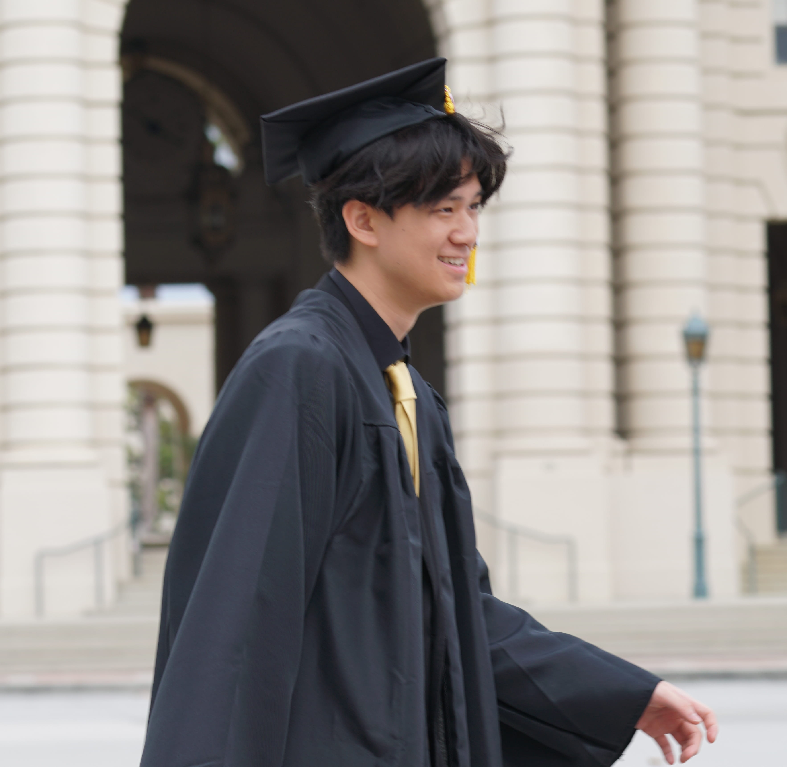{.member-photo alt="Portrait of nathan Wang"}
**Nathan Wang**  
Undergraduate Student, Neurosciences
:::

::: {.member-card}
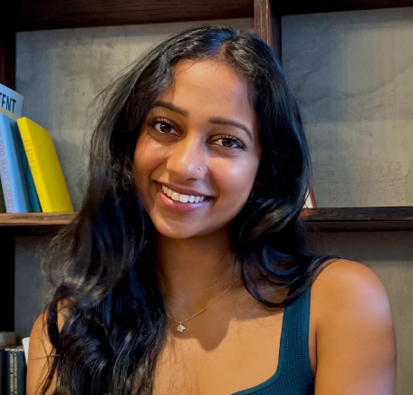{.member-photo alt="Portrait of Nina Phatak"}
**Nina Phatak**  
Undergraduate Student, Bioengineering
:::

::: {.member-card}
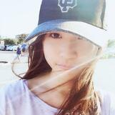{.member-photo alt="Portrait of Yuzhu Duan"}
**Yuzhu Duan**  
Graduate Student, GGB
:::

::: {.member-card}
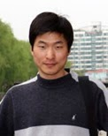{.member-photo alt="Portrait of Jianhai Zhang"}
**Jianhai Zhang**  
Graduate Student, GGB
:::

::: {.member-card}
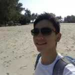{.member-photo alt="Portrait of Le Zhang"}
**Le Zhang**  
Graduate Student, GGB
:::

::: {.member-card}
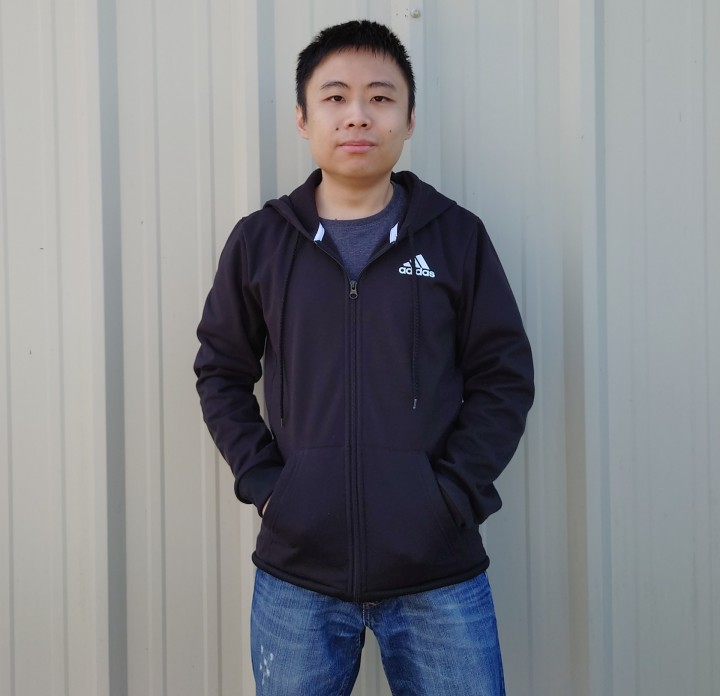{.member-photo alt="Portrait of Austin Leong"}
**Austin Leong**  
Programmer
:::

::: {.member-card}
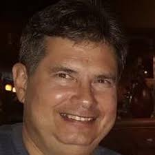{.member-photo alt="Portrait of Gordon Mosher"}
**Gordon David Mosher**  
Undergraduate Student, Statistics
:::

::: {.member-card}
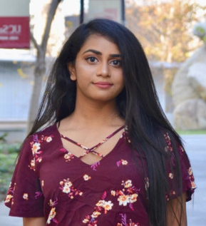{.member-photo alt="Portrait of Ponmathi Ramasamy"}
**Ponmathi Ramasamy**  
Undergraduate Student, Bioengineering
:::

::: {.member-card}
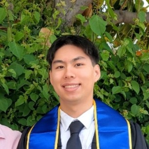{.member-photo alt="Portrait of Maxwell Hom"}
**Maxwell Hom**  
Undergraduate Student
:::

::: {.member-card}
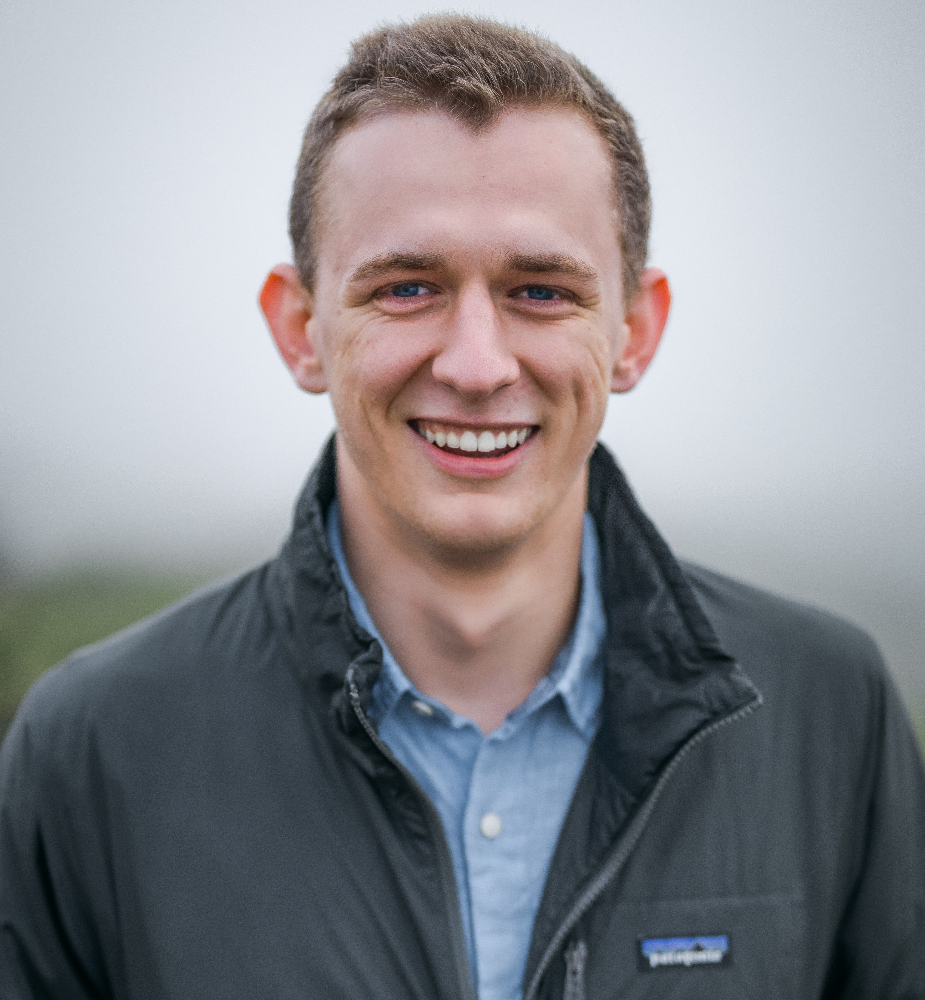{.member-photo alt="Portrait of Ryan Gates"}
**Ryan Gates**  
Undergraduate Student
:::

:::

::: {.member-list}
- **Eric Guisa**
- **Sidd Lokray**

:::

## Alumni

### Former Postdoctoral Scholars

::: {.member-grid}

::: {.member-card}
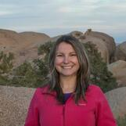{.member-photo alt="Portrait of Daniela Cassol"}
**Daniela Cassol**  
Postdoctoral Scholar, Bioinformatics
:::

::: {.member-card}
**Siddhartha Kanrar**  
Postdoctoral Scholar, Molecular Biology
:::

::: {.member-card}
**Pedro Rodrigues**  
Postdoctoral Scholar, Molecular Biology
:::

::: {.member-card}
**Varun Khanna**  
Postdoctoral Scholar, Cheminformatics
:::

::: {.member-card}
**Kei Iida**  
Postdoctoral Scholar, Bioinformatics
:::

:::

### Former Graduate Students

::: {.member-grid}

::: {.member-card}
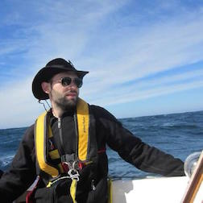{.member-photo alt="Portrait of Tyler Backman"}
**Tyler Backman**  
Graduate Student, Bioengineering
:::

::: {.member-card}
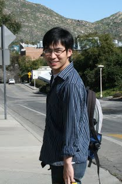{.member-photo alt="Portrait of Yiqun Eddie Cao"}
**Yiqun Eddie Cao**  
Graduate Student, Computer Sciences
:::

::: {.member-card}
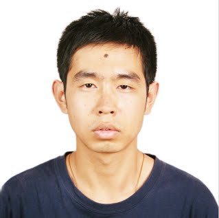{.member-photo alt="Portrait of Ergude Bao"}
**Ergude Bao**  
Graduate Student, Computer Sciences
:::

::: {.member-card}
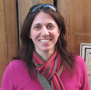{.member-photo alt="Portrait of Anna Charisi"}
**Anna Charisi**  
Graduate Student, Genetics, Genomics and Bioinformatics
:::

::: {.member-card}
**Yan Wang**  
Master Student, Computer Sciences
:::

:::

::: {.member-list}
- **Qiong Jia**
- **Shiyuan Guo**
- **Jisu Ha**
- **Anna Charisi**
- **Jorge Rodriguez**
- **Hua Tran**
:::

### Former Undergraduate Researchers and Staff

::: {.member-list}
- **Xinyang Li**
- **Siddharth Sai**
- **Cindy Nguyen**
- **Anna Alber**
- **Şeydanur Tıkır**
- **Patrick Tran**
- **John Sharifi**
- **Rebecca Sun**
- **Chris Webber**
- **Aleksandr Levchuk**
- **Lei Wang**
- **Junmei Liu**
- **Shawn Lesniak**
- **Julian Krause**
- **Li-Chang Cheng**
- **Christoph Sapper**
- **Ronly Schlenk**
- **Jack Cui**
:::
