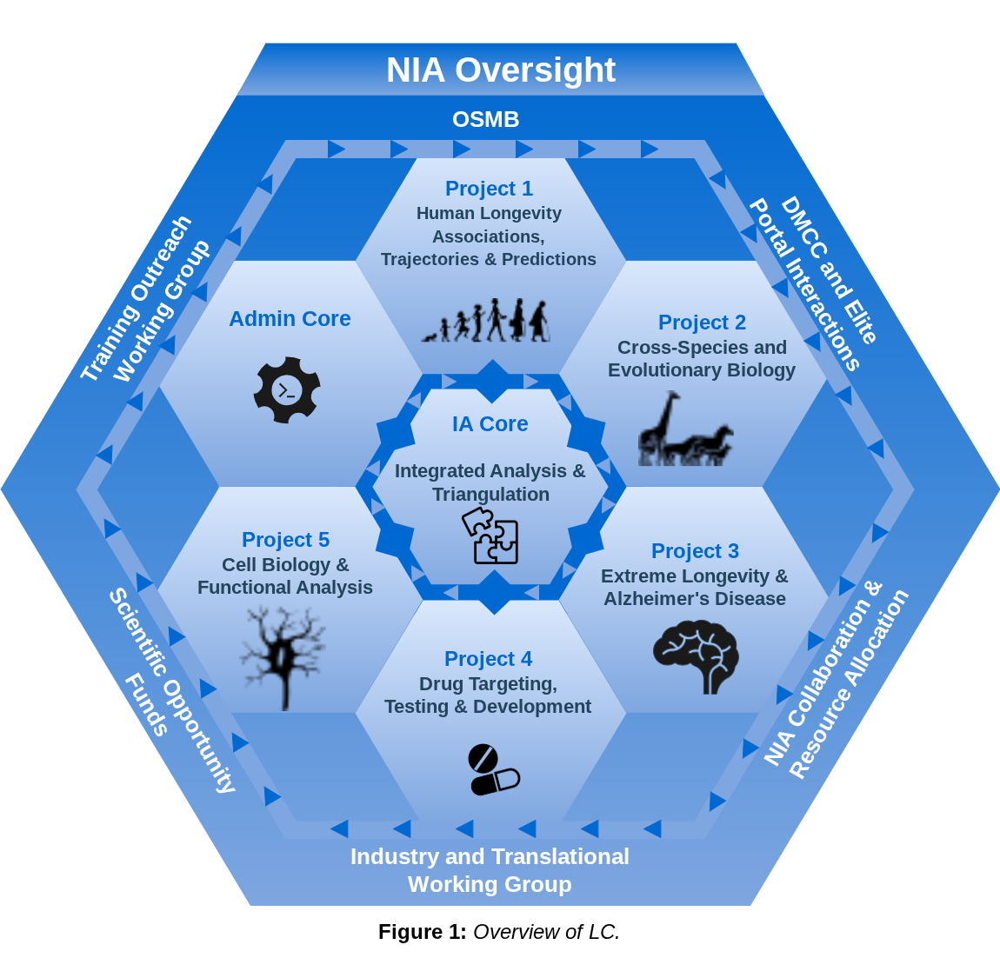
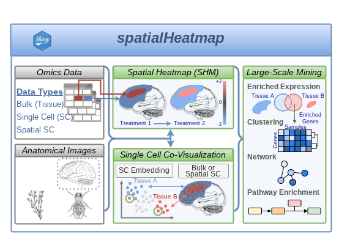
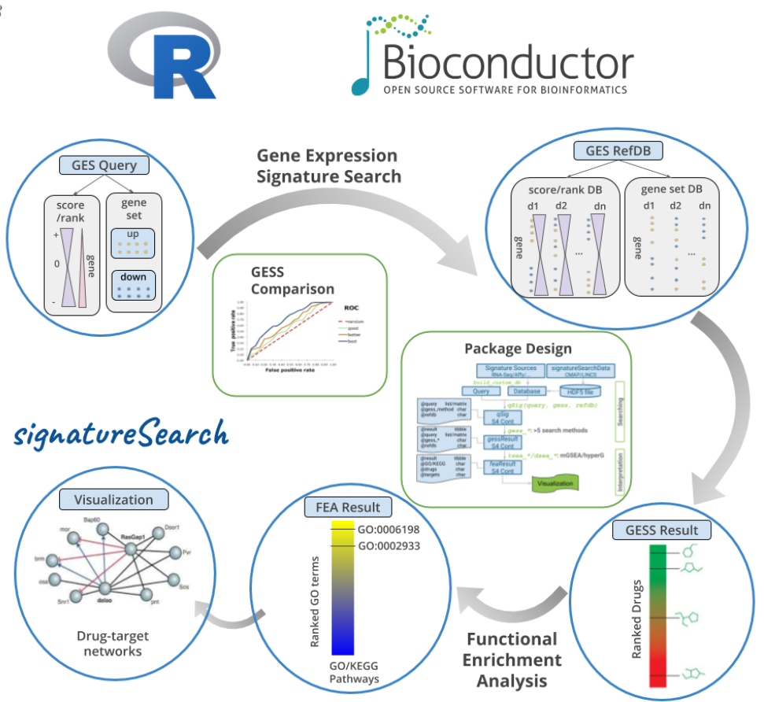
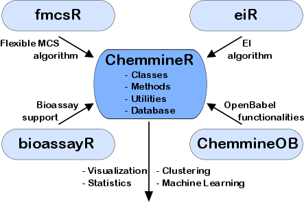
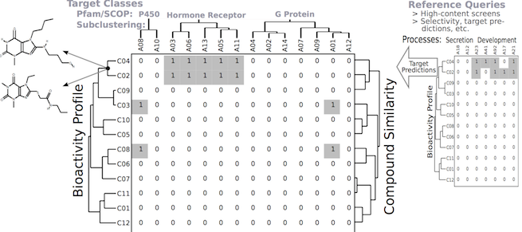
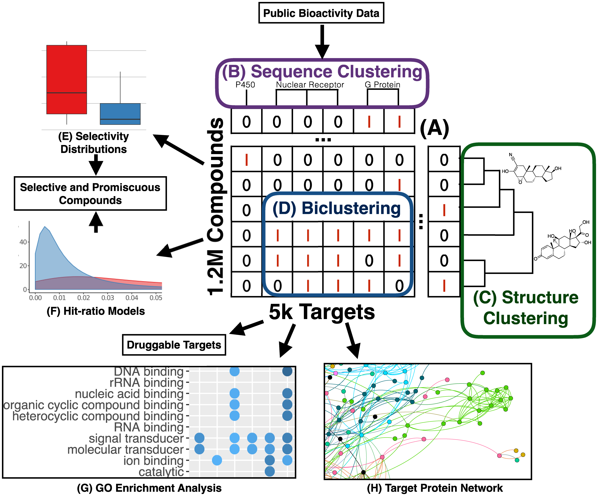

::: {.projects-intro}
The Girke lab develops computational methods and software at the interface of genome biology, chemical genomics, and bioinformatics. Below is a brief overview of selected research projects, with each project highlighting a representative theme of the lab’s work.
:::

## systemPipeR: Reproducible Workflow Management for Data-Intensive Life Science Research
::: {.project-block}

::: {.project-text}

Modern life science research increasingly relies on complex, multi-step computational analyses of large and heterogeneous datasets, creating major challenges for workflow organization, reproducibility, and transparency. systemPipeR is a workflow management environment that enables researchers to design, execute, monitor, and document sophisticated data analysis pipelines within a unified framework. It integrates statistical analysis in R with widely used bioinformatics software and supports execution on personal computers as well as high-performance computing environments. By combining workflow visualization, scalable execution, and automated analysis reporting, systemPipeR helps make modern data-driven research more efficient, reproducible, and standardized.

::: {.project-links}
[Software](https://systempipe.org/) · [Related paper](#)
:::
:::

::: {.project-figure}
{alt="Visual summary of the systemPipeR workflow management environment"}

::: {.project-caption}
Visual overview of the systemPipeR workflow framework.
:::
:::

:::

## Interventions Promoting Healthy Aging and Longevity
::: {.project-block .reverse}

::: {.project-text}

The Girke lab develops AI-based strategies to identify drugs, natural
compounds, and combination therapies that promote healthy aging and delay
age-related disease. By integrating large-scale omics signatures, genetic and
pharmacological perturbation data, and new methods for drug–target discovery,
this work seeks to uncover more effective and sustainable interventions for
extending health span.

Experimental validation is performed in collaboration with consortium
scientists using mouse models and human iPSC systems, including groups at the
Salk Institute and the University of Michigan. These combined efforts aim to
translate computational discoveries into more precise and personalized
approaches for healthier aging in humans. This research is supported by a
cooperative U19 grant from the National Institute on Aging at the National
Institutes of Health ([U19AG023122 ](https://reporter.nih.gov/search/VtfqPb0QikuyJA7-35r-5g/project-details/11195694)).

::: {.project-links}
[Related papers](https://www.longevityconsortium.org/resources/publications/) · [Project page](https://www.longevityconsortium.org/)
:::
:::

::: {.project-figure}
{alt="Visual summary LC"}

::: {.project-caption}
Overview of Longevity Consortium.
:::
:::

:::

## spatialHeatmap: Visualizing Spatial Bulk and Single-Cell Assays in Anatomical Images
::: {.project-block}

::: {.project-text}

The _spatialHeatmap_ package enables intuitive visualization of single-cell, spatial, and other tissue-resolved omics data by overlaying quantitative assay values onto anatomical images. It combines spatial heatmaps with complementary clustering and network-based views, and is available both as an R package and as an interactive Shiny application for exploratory analysis by computational and experimental users alike.

::: {.project-links}
[Software](https://spatialheatmap.org/) · [Related paper](https://pubmed.ncbi.nlm.nih.gov/38312938/)
:::
:::

::: {.project-figure}
{alt="Spatial Data Visualization"}

::: {.project-caption}
Spatial data visualization in anatomical images.
:::
:::

:::

## Gene Expression Searching with _signatureSearch_
::: {.project-block .reverse}

::: {.project-text}

The signatureSearch package provides an integrated R/Bioconductor environment
for searching gene expression signatures across large reference databases
derived from disease states, genetic backgrounds, chemical perturbations, and
single-cell datasets. By combining signature matching with functional
enrichment analysis and network-based visualization, it helps reveal related
cellular responses, identify perturbed biological processes, and support
discovery of novel drug, pathway, and cell-state connections.

::: {.project-links}
[Software](https://bioconductor.org/packages/devel/bioc/html/signatureSearch.html) · [Related paper](https://pubmed.ncbi.nlm.nih.gov/33068417/)
:::
:::

::: {.project-figure}
{alt="Gene Expression Searching with signatureSearch"}

::: {.project-caption}
Signature searching.
:::
:::

:::

## Software for Small Molecule Discovery and Chemical Genomics
::: {.project-block .reverse}

::: {.project-text}

The _ChemmineR_ environment is a modular software infrastructure designed for
modeling similarities among drug-like small molecules and high-throughput
screening data in drug discovery and chemical genomics. It consists of five
R/Bioconductor packages and the user-friendly ChemMine Tools web interface,
providing utilities for molecule processing, property prediction, structural
similarity searching, and clustering. A key component is the _fmcsR_ algorithm,
which provides mismatch-tolerant maximum common substructure searches and has
demonstrated superior virtual screening performance. Related software and
resources include _ChemmineOB_ and _eiR_.

::: {.project-links}
Related papers and software: ChemmineR ([PubMed](https://pubmed.ncbi.nlm.nih.gov/18596077/), [Bioc](https://bioconductor.org/packages/release/bioc/html/ChemmineR.html)) · ChemmineOB ([Bioc](https://bioconductor.org/packages/release/bioc/html/ChemmineOB.html)) · fmcsR ([PubMed](https://pubmed.ncbi.nlm.nih.gov/23962615/), [Bioc](https://bioconductor.org/packages/release/bioc/html/fmcsR.html)) · eiR ([PubMed](https://pubmed.ncbi.nlm.nih.gov/20179075/), [Bioc](https://www.bioconductor.org/packages/release/bioc/html/eiR.html)) · Chemmine Tools ([Web](https://chemminetools.ucr.edu/), [PubMed](https://pubmed.ncbi.nlm.nih.gov/21576229/))
:::
:::

::: {.project-figure}
{alt="Chemical Genomics"}
{alt="Chemical Genomics"}

::: {.project-caption}
Chemical genomics.
:::
:::

:::

## Drug-target interaction analysis
::: {.project-block .reverse}

::: {.project-text}

The _drugTargetInteractions_ package provides tools for identifying known and
candidate interactions between small molecules and their gene or protein
targets. By leveraging the extensive bioactivity information available in the
public domain, including the ChEMBL database, it supports efficient mapping of
drug–target relationships for applications in chemical biology, target
discovery, and translational drug research.

::: {.project-links}
Software: [Bioc](https://www.bioconductor.org/packages/release/bioc/html/drugTargetInteractions.html)
:::
:::

::: {.project-figure}
{alt="Chemical Genomics"}

::: {.project-caption}
Drug-target interaction mining.
:::
:::

:::

## Large-scale bioactivity analysis
::: {.project-block .reverse}

::: {.project-text}

This project used large-scale bioactivity data to compare how approved drugs
and other small molecules interact with many different protein targets. The
study uncovered numerous promising new drug and target candidates while also
helping distinguish compounds with selective activities from those with broad,
less specific effects, providing a valuable resource for future drug discovery
efforts.

::: {.project-links}
[Related paper](https://pubmed.ncbi.nlm.nih.gov/28178331/)
:::
:::

::: {.project-figure}
{alt="Large-scale bioactivity analysis"}

::: {.project-caption}
Bioactivity data mining strategy.
:::
:::

:::

