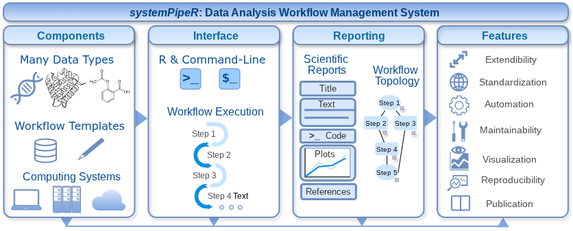

::: {.projects-intro}
The Girke lab develops computational methods and software at the interface of genome biology, chemical genomics, and bioinformatics. Below is a brief overview of selected research projects, with each project highlighting a representative theme of the lab’s work.
:::

::: {.project-block}

::: {.project-text}
## systemPipeR: Reproducible Workflow Management for Data-Intensive Life Science Research

Modern life science research increasingly relies on complex, multi-step computational analyses of large and heterogeneous datasets, creating major challenges for workflow organization, reproducibility, and transparency. systemPipeR is a workflow management environment that enables researchers to design, execute, monitor, and document sophisticated data analysis pipelines within a unified framework. It integrates statistical analysis in R with widely used bioinformatics software and supports execution on personal computers as well as high-performance computing environments. By combining workflow visualization, scalable execution, and automated analysis reporting, systemPipeR helps make modern data-driven research more efficient, reproducible, and standardized.

::: {.project-links}
[Software](https://systempipe.org/) · [Related paper](#)
:::
:::

::: {.project-figure}
{alt="Visual summary of the systemPipeR workflow management environment"}

::: {.project-caption}
Visual overview of the systemPipeR workflow framework.
:::
:::

:::

::: {.project-block .reverse}

::: {.project-figure}
{alt="Visual summary for Project Title 2"}

::: {.project-caption}
Optional short figure caption or leave this out.
:::
:::

::: {.project-text}
## Project Title 2

Text text text text text text
Text text text text text text
Text text text text text text
Text text text text text text
Text text text text text text

::: {.project-links}
[Related paper](#)
:::
:::

:::

::: {.project-block}

::: {.project-text}
## Project Title 3

Text text text text text text
Text text text text text text
Text text text text text text
Text text text text text text
Text text text text text text

::: {.project-links}
[Related paper](#) · [Project page](#)
:::
:::

::: {.project-figure}
{alt="Visual summary for Project Title 3"}

::: {.project-caption}
Optional short figure caption or leave this out.
:::
:::

:::
